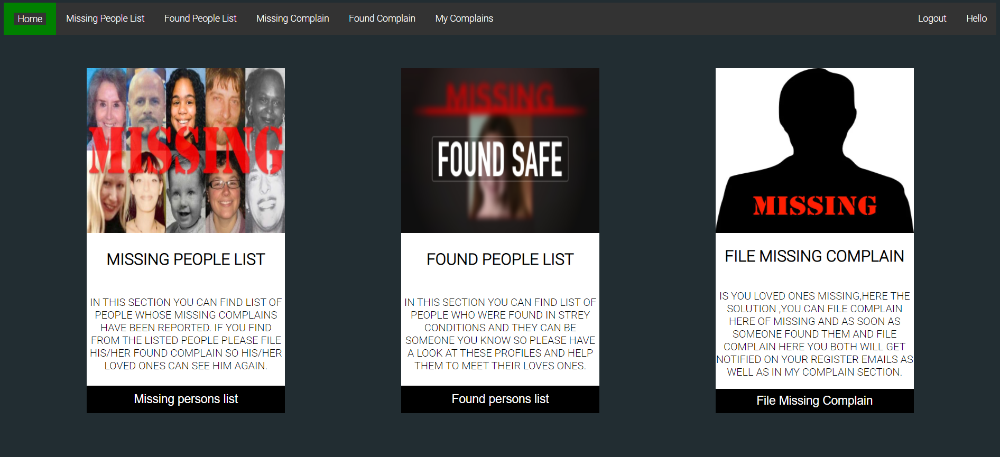
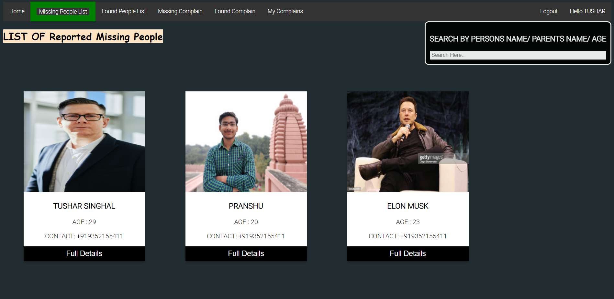
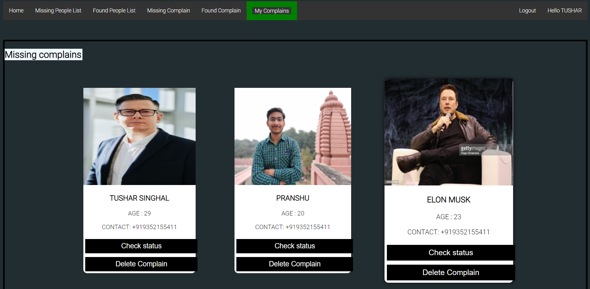
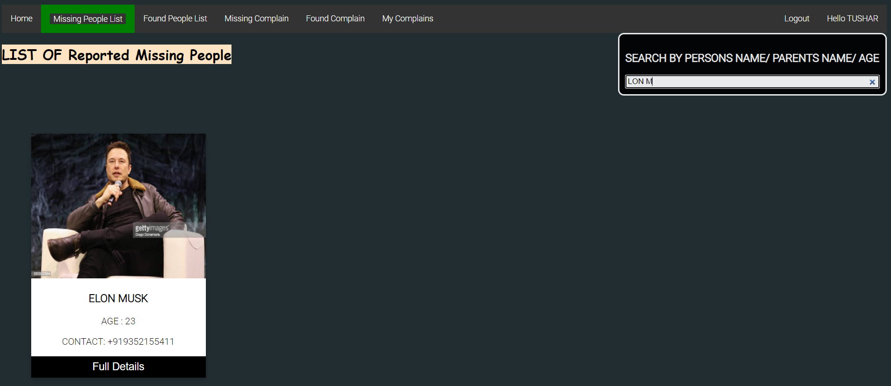
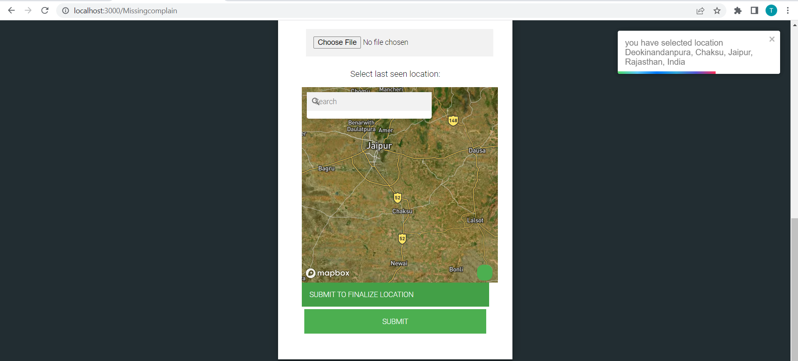

# Find Missing People

  

Find Missing People is an web application where you can file complain for missing people as well as if you found someone in strey condtions or someone
got lost form their loved ones and this application uses face recognization to match profile of Missing people and Found people such that if 
you file a missing complain of someone and someother people may be after sometime found him and file complain of found so this application notify both 
user that they got a match.

> #### List of Features it currently Supports includes : 

* Matching Missing Person Profile To Found Person Profile via Face Recognization Azure Api 
* Email Notificaton when got A match 
*  Async Task Sechdulding via Celery on Backend Server For Better Performance and Less Waiting Time
*  Fuzzy Search For Searching in List of Profiles for Better Filtering 
* 👤 User Authenticaion 
* Authentication also Supports Google Login
* 

> ## Documentation
- [Presentation](https://docs.google.com/presentation/d/1z6csQ5YHbrYu9RsSbmHp7JdDms3Ntkd4fReq6RBJtD0/edit?usp=sharing)

> ## Table of Content 

* [Deployment](#deployment)
* [Tools and Technologies Used](#tools-and-technologies-used)
* [Usage](#usage)
* [Local Setup](#local-setup)
* [Improvements](#improvements)
* [License](#license)
* [Screenshots](#screenshots)

> ## Deployment 

Deployed Website (on Heroku): https://readymeet.herokuapp.com/
* Frontend Server is deployed to Netlify
* Backend Server is Deployed to Heroku 
* PostGres Databse on Heroku
* Celery On Heroku
* Media Files On cloudinary (https://cloudinary.com/)
* To Run Project only need to Run Frontend () Backend Is already attched to it

> ## Tools and Technologies Used
* React, Bootstrap For Frontend Server
* Django Rest FrameWork For Backend Server
* Celery For Running Async Tasks On backend Server 
* Azure Face Detection Api for Facedetection 
* Azure Face Verifiaction Api for Face verification
* Mapbox For embedding Maps
* gecoding and reverse geocoding for Api's for fecthing Location from cordinates
* Auto Suggest Mapbox Api for Loaction Seacrh Bar
* Smtp For Email Notifiaction From Backend Server(Django Rest Framework)
* OAUT 2.0 For Google Login
* Fuse.js For Fuzzy Search
* React Toast for alearts
*  Cloudinary For Storing Media Files
*  Used Sqlite for Local setup and Postgres for Deployment

> ## Usage
* This web-application has varying permmisions for Visiting Diffrent Section of Website
* To see Home-Page Section , Missing People List Section , Found People List Section ANd Visting  Any Full Profie Card User Dont need to Sign-in/Sign-up
 On this Website These Sections Are Open To All .
* For Filing any complain of Missing Or Found You Need to Login/Register in Web-Application as an User.Qucik Login is aviliable via Google Login.
* In Missing People List Section You can find every Missing Complain Which is Registered On my Application And Not Yet Taken Back. So Here You See 
 Some Profie Card Which Has a Full detials Button Which when clicked Will Show You The Full Profie Regarding that card. The Found People List section is also designed in the same way.
* On Missing People List Section and Found People List you also get an Search bar where you can search profile via Name or father Name or Mother Name or Age. This is a Fuzzy Search so No need to be very confident with your spellings  .
*                                              Filing Complain(Missing/Found)
* When Head To File complain section either Missing or Found You Have to Login in Webapp as a user. Then fill for with the details of whom you are fill This Form
two thing to keep in mind first is enter your contact number in valid format(first writing country code then give space and write yourrest of the number without country code)  and second thing is Upload clear and face detectable image . in either of the case you will get alert and have to fill complain again.
 *                                               My Complain Section
* When head over to mycomplain section(only visible after login) you will see all missing and found complains registerd by you in seprated boxes there you got 
two buttons for every profie first is "CHECK STATUS" button where you can see what's going with your request means here you see all the matching profiles.
 *                                                 Mathcing Profiles
* Matching profiles means if you file a Missing Complain and someone else files a Found coplain  or vise-versa and face both both the profils are similer (similarity is judged by Azure Face varifiaction Api) Then these Profies are categorized as matching profies.
* Another Profile control you get in My Profie Section is to delete Profie.
 *                                                  What Happens When Got a match
 * Both The User involved in match got mail from website-email(missingperson4655@gmail.com) There they got link of Profile Of whom They Got Match
 * As well as in my complain section they can check status where they can se those matching profiles
 
> ## Local Setup
> *                                      First Setup Backend such that when you start frontend it give full functionality.
* For Running this application with full funtionality On your Local Pc You to setup both backend-server(https://github.com/codelover4655/eng_backend)
   and frontend-server(https://github.com/codelover4655/eng_frontend)
 *                                         STEPS TO SETUP FRONTEND SERVER
Pre-Requisites: You must have Nodejs installed locally on your system
* Clone the Repository `git clone https://github.com/codelover4655/eng_frontend.git` or directly download the zip file.
* Move to the directry where this cloned file exist(if cloned in C folder directly so run commed in cmd `cd eng_frontend`)
* Intall the Dependencies `npm install`
* Starting the App `npm start` or `node server.js`
* Open `http://localhost:3000/` to view the App
* be ensure this port is free for host

                                                STEPS TO SETUP BACKEND SERVER
* Clone the Repository `https://github.com/codelover4655/eng_backend.git` or directly download the zip file.                                            
* Install virtual enviourment for python as there may be some dependencies which OS not give access to install on system directly
* Process to install and create virtual envirment varies for diffrent operterating systems (supporting docs-https://docs.python.org/3/library/venv.html)      
* after activating virtual environment (if required)
* Move to directry where you cloned backend files. root directory of app  (`cd eng_backend`if cloned directly in C folder)
* Run `pip install -r requirements.txt` for installing all the dependencies
* after installing dependencies Run `python manage.py runserver 8000`
* Port must be 8000 because in frontend side it is linked with port 8000 
* Now Django server is running on local server 
* Now Run Celery Server which support Async Request Handling to Run celery Server
* Run `celery -A eng_backend worker --pool=solo -l info` From the root directory of App 
* After Both Servers Started running Backend starts giving Response to all Api Request.                                        
> ## Improvements

* The Project has various rooms for improvements from scaling Application to adding new Features like As of Now i reduced the waiting time of user by 
using Async Task sechdulding like When User Files a missing complian i Run a Async task in backend to Search Whole database Foe similer Faces and 
send a Email notification when Found a match by this user may not have to wait for conformation but searching whole database is a time consuming task 
so This is a site of imporvement in my project.

😃 Suggestions and Contibutions are Welcomed! Feel free to Reach out to me! **[Tushar Singhal](https://github.com/codelover4655)**

> ## Screenshots 
* Home Page 

* Missing People List

*  MY COMPLAINS

*  Fuzzy Search

*  Map Features

* Email Notification

